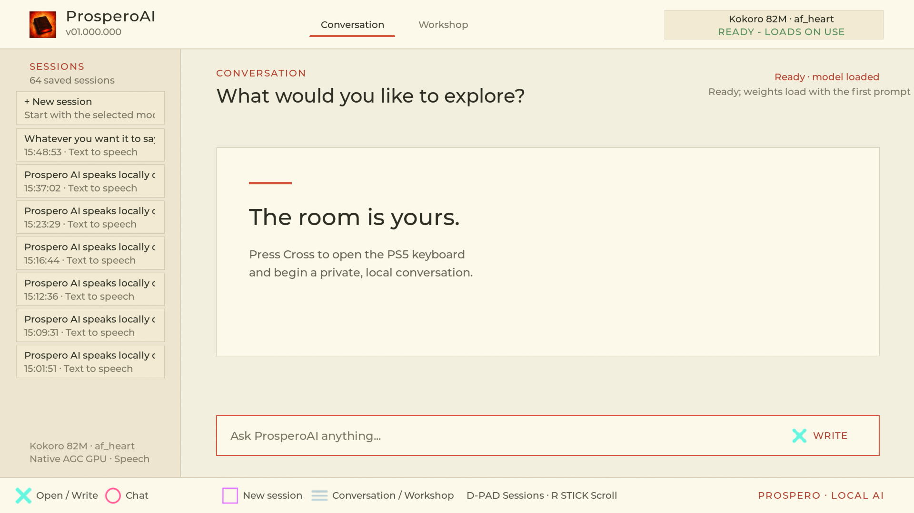

> **Disclaimer:** This is an AI-assisted project developed using OpenAI Codex.

<p align="center">
  
</p>

<h1 align="center">ProsperoAI</h1>

<p align="center">
  <strong>Private, local generative AI for PlayStation 5 homebrew</strong><br>
  Chat, create 512 × 512 images, generate short audio, and synthesize speech
  with models running locally through the PS5 GPU.
</p>

<p align="center">
  
  
  
  
  <a href="LICENSE"></a>
</p>

Demo available by clicking the image below.

[](https://i.imgur.com/vRqZFqn.mp4)

## Highlights

- Runs supported models locally without an account, cloud API, or conversation upload.
- Uses native PS5 AGC GPU compute for the model paths; this is not a ROCm port.
- Switches between Mistral, Qwen, SD-Turbo, Stable Audio, and Kokoro model purposes in Workshop.
- Stores independent text, image, audio, and speech sessions under `/download0`.
- Supports DualSense navigation, right-stick conversation scrolling, the PS5 on-screen keyboard, and a physical USB keyboard.
- Ships without model weights. Users choose and install curated model folders separately.

> [!IMPORTANT]
> ProsperoAI does not run on an unmodified retail console. It is intended for
> consoles you own with an already configured, compatible homebrew loader.
> This repository does not include an exploit, proprietary Sony SDK, firmware,
> system module, key, or model weight.

## Project foundation

> [!IMPORTANT]
> **Built on the [PS5 Native App Boilerplate](https://github.com/blackbearreloaded/ps5-native-app-boilerplate).**
> ProsperoAI preserves its reproducible native build, packaging, deployment,
> and release foundation.

> [!IMPORTANT]
> **GPU compute work is documented in [PS5 GPU Research](https://github.com/blackbearreloaded/ps5-gpu-research).**
> The companion repository records the native AGC GPU research that made
> ProsperoAI's local model runtimes possible.

## Supported curated models

| Model | Purpose | Installed size | Hardware result |
| --- | --- | ---: | --- |
| [Mistral 7B Instruct v0.3 Q4_0](https://huggingface.co/blackbearreloaded/ProsperoAI-Mistral-7B-Instruct-v0.3-Q4_0-PS5) | Text to text | 4.35 GiB | About 1.4–1.5 s load and 25–29 tokens/s for short, resident-context replies |
| [Qwen3.5 9B Q4_0](https://huggingface.co/blackbearreloaded/ProsperoAI-Qwen3.5-9B-Q4_0-PS5) | Text to text | 6.37 GiB | 3.72 s switch/load; 1.46 s measured 44-token prefill and about 30 tokens/s decode |
| [SD-Turbo FP16](https://huggingface.co/blackbearreloaded/ProsperoAI-SD-Turbo-FP16-PS5) | Text to image | 2.40 GiB | 512 × 512 image in about 76 seconds |
| [Stable Audio Open Small FP16](https://huggingface.co/blackbearreloaded/ProsperoAI-Stable-Audio-Open-Small-FP16-PS5) | Text to audio | 1.32 GiB | 0.372-second stereo clip in about 62 seconds |
| [Kokoro 82M FP16](https://huggingface.co/blackbearreloaded/ProsperoAI-Kokoro-82M-FP16-PS5) | Text to speech | 165 MiB | 1.975 seconds of 24 kHz speech in about 79 seconds |

The linked repositories contain the exact directory layout, integrity hashes,
upstream provenance, licenses, and preparation recipe for each model. Do not
rename or mix their internal files.

### Performance notes

These are measured Alpha results from one PS5 on firmware 6.02, not guaranteed
benchmarks. Text decode figures describe a loaded model with a short or reused
context. The first prompt also pays model-loading and prefill cost. Attention
work grows with conversation length, so long sessions respond more slowly.
The 4,096-token text context boundary has been hardware-validated, but keeping
active conversations below roughly 2,000 tokens is currently more comfortable.

Image, general-audio, and speech generation prioritize correctness over speed.
Stable Audio currently emits only its short deterministic validation clip, and
Kokoro still uses a correctness-first CPU fallback for part of waveform
generation. Both are functional demonstrations rather than real-time paths.

## Install the app and models

1. Download `PPSA99004.zip` from the latest
   [GitHub release](https://github.com/blackbearreloaded/ProsperoAI/releases).
2. Extract it. The archive contains a complete `PPSA99004/` app folder and an
   intentionally empty `PPSA99004/models/` directory.
3. Open one of the curated Hugging Face repositories above, download the whole
   repository, and copy its named model folder into `PPSA99004/models/`.
4. Repeat step 3 for any other models you want available in Workshop.
5. Upload the complete `PPSA99004` directory to `/data/homebrew/`, producing
   `/data/homebrew/PPSA99004/eboot.bin`.
6. Refresh or restart your homebrew loader, then launch ProsperoAI.

For example:

```text
PPSA99004/
├── eboot.bin
├── models/
│   ├── README.txt
│   ├── mistral-7b-instruct-v0.3-q4-0/
│   │   ├── model.ps5lm
│   │   ├── tokenizer.ps5tok
│   │   └── model.json
│   └── sd-turbo-fp16/
│       ├── model.json
│       ├── text_encoder/
│       ├── unet/
│       └── vae/
└── sce_sys/
```

Keep each downloaded model folder intact. ProsperoAI discovers all valid model
folders at launch and shows their friendly names and purposes in Workshop. If
no compatible model is installed, the app opens normally and explains where to
add one.

The folder ZIP is the recommended distribution because models must be inserted
before the title is mounted. The model-free `.ffpfsc` artifact is also produced
for loader and UI validation, but using it with models requires an advanced
unpack/repack workflow.

## Using ProsperoAI

| Input | Action |
| --- | --- |
| D-pad / left stick | Select saved sessions or change Workshop settings |
| Cross | Open a session, activate a control, or write a prompt |
| Circle | Return to Conversation |
| Square | Start a new session |
| Triangle | Delete the selected session or play/replay its generated audio |
| Options | Switch between Conversation and Workshop |
| Right stick | Scroll through the current conversation |
| Physical USB keyboard | Type in the prompt field; Enter sends |

Each conversation is an independent session. Text and metadata are saved under
`/download0/ProsperoAI/sessions/`; generated image and audio files live inside
the matching session directory. Deleting a session removes its associated
content. ProsperoAI does not send these files to a network service.

## Build

Build from Linux, WSL, or an Ubuntu-compatible CI runner:

```bash
sudo apt update
sudo apt install clang-18 clang-format-18 lld-18 make python3 python3-venv \
  tar unzip wget

make check
make ffpfsc
```

Outputs:

```text
dist/PPSA99004/           complete model-free app folder
dist/PPSA99004.ffpfsc     compressed model-free image
```

The build downloads and verifies the public PS5 Payload SDK, zlib, and MkPFS
inside the ignored `.deps/` directory. It rebuilds the clean-room `libc.prx`
runtime, compiles the native app, signs the executable, validates assets, and
assembles the release. Model weights are never downloaded by the app build.

## GitHub Actions

The [Build workflow](.github/workflows/build.yml) runs on pushes to `main`,
pull requests, release tags, and manual dispatch. It:

1. validates source, metadata, and presentation assets;
2. reproduces and verifies the clean-room runtime shim;
3. builds `PPSA99004.ffpfsc` and archives the complete folder as
   `PPSA99004.zip`;
4. rejects an artifact containing model data;
5. writes `SHA256SUMS` and uploads all three release files; and
6. publishes those verified files when the workflow is triggered by a `v*` tag.

## Project layout

```text
src/                 ProsperoAI UI, sessions, model routing, and GPU runtimes
src/backends/        Mistral and Qwen architecture-specific AGC programs
include/             Application interfaces
assets/              RmlUi documents, styles, fonts, and controller icons
sce_sys/             PS5 title metadata, artwork, icon, and selection music
models/README.txt    Model-free release placeholder and install guidance
vendor/              Pinned headers and static runtime dependencies
runtime/             Clean-room libc runtime inputs and integrity record
tooling/native/      Native ELF/FSELF and runtime build tools
tools/               Build, dependency, validation, packaging, and deploy scripts
```

## Identity

| Identity | Value |
| --- | --- |
| Shell title | `ProsperoAI` |
| Title ID | `PPSA99004` |
| Current app version | `01.000.000` |
| Writable data | `/download0` |
| Compute backend | Native PS5 AGC GPU |

## Credits and license

ProsperoAI builds on the
[PS5 Native App Boilerplate](https://github.com/blackbearreloaded/ps5-native-app-boilerplate)
and the public [PS5 Payload SDK](https://github.com/ps5-payload-dev/sdk).
Its interface uses [RmlUi](https://github.com/mikke89/RmlUi),
[SDL2](https://github.com/libsdl-org/SDL/tree/SDL2), and
[FreeType](https://freetype.org/). Model runtimes incorporate work from
[llama.cpp](https://github.com/ggml-org/llama.cpp),
[stable-diffusion.cpp](https://github.com/leejet/stable-diffusion.cpp),
[Stable Audio Open Small](https://huggingface.co/stabilityai/stable-audio-open-small),
and [Kokoro](https://huggingface.co/hexgrad/Kokoro-82M).

See [NOTICE.md](NOTICE.md) for dependency and model notices. ProsperoAI is
distributed under [GPL-3.0-or-later](LICENSE). PlayStation and PS5 are
trademarks of Sony Interactive Entertainment. ProsperoAI is an independent
homebrew project and is not affiliated with or endorsed by Sony or the model
authors.

This project was developed with assistance from OpenAI Codex. Project
maintainers reviewed and hardware-validated the resulting code, assets,
documentation, and model integrations.
