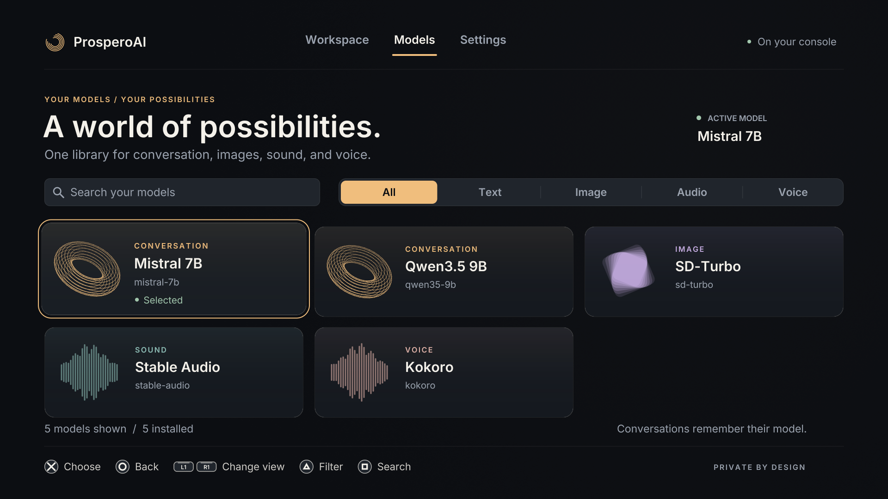

<p align="center">
  
</p>

<h1 align="center">ProsperoAI</h1>

<p align="center">
  <strong>Private, local generative AI for PlayStation 5 homebrew</strong><br>
  Chat, create 512 × 512 images, generate short audio, and synthesize speech
  with models running locally through the PS5 GPU.
</p>

<p align="center">
  
  
  
  
  <a href="LICENSE"></a>
</p>



The interface is built with [ps5-homebrew-ui](https://github.com/blackbearreloaded/ps5-homebrew-ui),
fetched at a pinned commit when the app is built. This picture is the production frontend
drawn on a PC with stand-in models. See the [UI guide](docs/NATIVE_UI.md) for the pages,
how it is built, and what has not run on a console yet.

> [!WARNING]
> ProsperoAI is an experimental project for validating generative-AI workloads
> on the PS5 GPU. It is not production software.

## Highlights

- Runs supported models locally without an account, cloud API, or conversation upload.
- Uses native PS5 AGC GPU compute for the model paths; this is not a ROCm port.
- Searches and filters installed text, image, audio, and speech models in a scrolling library.
- Uses stable model IDs for selection and saved conversations, with no eight-model catalog limit.
- Offers Midnight and Daylight themes, a living backdrop, interface sounds, notices, reduced motion,
  high contrast, and larger text.
- Draws answers in Latin, Greek, Cyrillic, Chinese, Japanese and Korean with scalable faces.
- Stores independent text, image, audio, and speech sessions under `/download0`.
- Supports DualSense navigation, right-stick conversation scrolling, the PS5 on-screen keyboard, and a physical USB keyboard.
- Ships without model weights. Users choose and install curated model folders separately.

> [!IMPORTANT]
> ProsperoAI does not run on an unmodified retail console. It is intended for
> consoles you own with an already configured, compatible homebrew loader.
> This repository does not include an exploit, proprietary Sony SDK, firmware,
> system module, key, or model weight.

## Project foundation

> [!IMPORTANT]
> **Built on the [PS5 Native App Boilerplate](https://github.com/blackbearreloaded/ps5-native-app-boilerplate).**
> ProsperoAI preserves its reproducible native build, packaging, deployment,
> and release foundation.

> [!IMPORTANT]
> **GPU compute work is documented in [PS5 GPU Research](https://github.com/blackbearreloaded/ps5-gpu-research).**
> The companion repository records the native AGC GPU research that made
> ProsperoAI's local model runtimes possible.

## Supported curated models

| Model | Purpose | Installed size | Hardware result |
| --- | --- | ---: | --- |
| [Mistral 7B Instruct v0.3 Q4_0](https://huggingface.co/blackbearreloaded/ProsperoAI-Mistral-7B-Instruct-v0.3-Q4_0-PS5) | Text to text | 4.35 GiB | About 1.4–1.5 s load and 25–29 tokens/s for short, resident-context replies |
| [Qwen3.5 9B Q4_0](https://huggingface.co/blackbearreloaded/ProsperoAI-Qwen3.5-9B-Q4_0-PS5) | Text to text | 6.37 GiB | 3.72 s switch/load; 1.46 s measured 44-token prefill and about 30 tokens/s decode |
| [SD-Turbo FP16](https://huggingface.co/blackbearreloaded/ProsperoAI-SD-Turbo-FP16-PS5) | Text to image | 2.40 GiB | 512 × 512 image in about 76 seconds |
| [Stable Audio Open Small FP16](https://huggingface.co/blackbearreloaded/ProsperoAI-Stable-Audio-Open-Small-FP16-PS5) | Text to audio | 1.32 GiB | 0.372-second stereo clip in about 62 seconds |
| [Kokoro 82M FP16](https://huggingface.co/blackbearreloaded/ProsperoAI-Kokoro-82M-FP16-PS5) | Text to speech | 165 MiB | 1.975 seconds of 24 kHz speech in about 79 seconds |

The linked repositories contain the exact directory layout, integrity hashes,
upstream provenance, licenses, and preparation recipe for each model. Do not
rename or mix their internal files.

### Prepare text models yourself

The open-source [model preparation tools](model-tools/) convert a supported
single-file GGUF into ProsperoAI's deterministic `model.ps5lm`,
`tokenizer.ps5tok`, and `model.json` bundle. Complete recipes for the validated
Mistral and Qwen models are included in the repository.

```bash
cd model-tools
./prepare-model \
  --provenance recipes/mistral-7b-instruct-v0.3-q4-0.json \
  /path/to/Mistral-7B-Instruct-v0.3.Q4_0.gguf \
  --output-dir /path/to/PPSA99004
```

The recipe verifies the exact upstream revision, byte count, SHA-256, tensor
layout, tokenizer, and every generated output. See the model-tools guide for
source-download commands, the Qwen example, recipe creation, supported GGUF
types, and the steps required when adding a new architecture.

A recipe prepares weights for a backend already implemented by ProsperoAI. It
cannot add an inference backend, tokenizer algorithm, or quantization format
that the application does not support.

### Performance notes

These are measured Alpha results from one PS5 on firmware 6.02, not guaranteed
benchmarks. Text decode figures describe a loaded model with a short or reused
context. The first prompt also pays model-loading and prefill cost. Attention
work grows with conversation length, so long sessions respond more slowly.
The 4,096-token text context boundary has been hardware-validated, but keeping
active conversations below roughly 2,000 tokens is currently more comfortable.

Image, general-audio, and speech generation prioritize correctness over speed.
Stable Audio currently emits only its short deterministic validation clip, and
Kokoro still uses a correctness-first CPU fallback for part of waveform
generation. Both are functional demonstrations rather than real-time paths.

## Install the app and models

1. Download `PPSA99004.zip` from the latest
   [GitHub release](https://github.com/blackbearreloaded/ProsperoAI/releases).
2. Extract it. The archive contains a complete `PPSA99004/` app folder and an
   intentionally empty `PPSA99004/models/` directory.
3. Open one of the curated Hugging Face repositories above, download the whole
   repository, and copy its named model folder into `PPSA99004/models/`.
4. Repeat step 3 for any other models you want available in Models.
5. Upload the complete `PPSA99004` directory to `/data/homebrew/`, producing
   `/data/homebrew/PPSA99004/eboot.bin`.
6. Refresh or restart your homebrew loader, then launch ProsperoAI.

For example:

```text
PPSA99004/
├── eboot.bin
├── models/
│   ├── README.txt
│   ├── mistral-7b-instruct-v0.3-q4-0/
│   │   ├── model.ps5lm
│   │   ├── tokenizer.ps5tok
│   │   └── model.json
│   └── sd-turbo-fp16/
│       ├── model.json
│       ├── text_encoder/
│       ├── unet/
│       └── vae/
└── sce_sys/
```

Keep each downloaded model folder intact. ProsperoAI discovers all valid model
folders at launch and shows their friendly names and purposes in Models. If
no compatible model is installed, the app opens normally and explains where to
add one.

Only the folder ZIP is distributed because models must be inserted before the
title is mounted.

## Using ProsperoAI

| Input | Action |
| --- | --- |
| D-pad / left stick | Move through models, conversations, or settings; Left reaches the conversation list |
| Cross | Start or open a conversation, write or send a prompt, choose a model, change a setting |
| Circle | Close a dialog, leave the conversation list, or return to the settings categories |
| L1 / R1 | Switch between Workspace, Models, and Settings |
| Square | Start a new conversation in Workspace; search in Models |
| Triangle | Step through the model kinds, retry a failed answer, delete the focused conversation, or play saved audio |
| Options | Ask to close the app, once nothing is running and the conversation is saved |
| Right stick | Scroll through the current conversation |
| Physical USB keyboard | Type in the prompt field or the model search; Enter sends |

The row at the bottom right of every page names what the buttons do there.

Each conversation is an independent session. Text and metadata are saved under
`/download0/ProsperoAI/sessions/`; generated image and audio files live inside
the matching session directory. Deleting a session removes its associated
content. ProsperoAI does not send these files to a network service.

## Build

Build from Linux, WSL, or an Ubuntu-compatible CI runner:

```bash
sudo apt update
sudo apt install ccache clang-18 clang-format-18 clang-tidy-18 lld-18 make \
  ninja-build pkg-config python3 python3-venv tar unzip wget

make check
make app
```

Outputs:

```text
dist/PPSA99004/           complete model-free app folder
dist/PPSA99004.zip        archived model-free app folder
```

The build downloads and verifies the public PS5 Payload SDK, the ps5-opengl SDK, the
ps5-homebrew-ui interface kit, the Noto Sans faces for Chinese, Japanese and Korean, and zlib
inside the ignored `.deps/` directory. It bakes the interface fonts, rebuilds the clean-room
`libc.prx` runtime, compiles the native app through parallel incremental Ninja builds,
caches compiler results with ccache, signs the executable, validates assets,
and assembles the release. Set `USE_CCACHE=0` to disable the cache or
`BUILD_JOBS=<count>` to limit parallel compilation. Model weights are never
downloaded by the app build.

## GitHub Actions

The [Build workflow](.github/workflows/build.yml) runs on pushes to `main`,
pull requests, release tags, and manual dispatch. It:

1. restores dependency and ccache data;
2. validates source, metadata, presentation assets, and the executable writer;
3. reproduces and verifies the clean-room runtime shim;
4. builds the complete model-free folder and `PPSA99004.zip` with Ninja;
5. rejects an artifact containing model data;
6. writes `SHA256SUMS` and uploads both release files; and
7. publishes those verified files when triggered by a version tag.

Every pull request gets an installable build named by its number and commit:
see [Pull-request builds](docs/PULL_REQUEST_BUILDS.md).

## Project layout

```text
src/                 ProsperoAI UI, sessions, model routing, and GPU runtimes
src/backends/        Mistral and Qwen architecture-specific AGC programs
include/             Application interfaces
assets/              The last-resort bitmap font (other fonts and sounds come from the kit)
ui-kit/              Which sources of the fetched interface kit are compiled
host/                Deterministic native-frontend capture harness
tests/console/       Scripts the app plays by itself in a test run on a console
sce_sys/             PS5 title metadata, artwork, icon, and selection music
models/README.txt    Model-free release placeholder and install guidance
model-tools/         GGUF converter, validated recipes, and porting guide
vendor/              Pinned headers and static runtime dependencies
runtime/             Clean-room libc runtime inputs and integrity record
tooling/native/      Native ELF/FSELF and runtime build tools
tools/               Build, dependency, validation, packaging, and deploy scripts
```

## Identity

| Identity | Value |
| --- | --- |
| Shell title | `ProsperoAI` |
| Title ID | `PPSA99004` |
| Current app version | `01.000.000` |
| Writable data | `/download0` |
| Compute backend | Native PS5 AGC GPU |

<!-- bbr-footer:start -->
<!-- Generated by ps5-homebrew-dev-protocol/scripts/readme-footer. Edit the template there, not here. -->

## Credits

Built with the [PS5 Payload SDK](https://github.com/ps5-payload-dev/sdk) by John Törnblom (ps5-payload-dev).
Third-party components, authors and licenses are listed in
[THIRD_PARTY_NOTICES.md](THIRD_PARTY_NOTICES.md).

## License

Copyright © 2026 BlackBearReloaded. Licensed under GPL-3.0-or-later; see [LICENSE](LICENSE). Third-party components keep their own licenses.

## Disclaimer

- **No affiliation.** This is an independent homebrew project. It is not
  affiliated with, endorsed by, or sponsored by Sony Interactive Entertainment.
  "PlayStation", "PS5" and related marks are trademarks of Sony Interactive
  Entertainment Inc. Model names belong to their authors, who do not endorse this project.
- **No proprietary material.** No Sony SDK, firmware, encryption keys or
  decrypted system modules are included.
- **No warranty.** This project is provided "as is", without warranty of any
  kind, to the extent permitted by law. See sections 15 and 16 of the GPL.
- **Use at your own risk.** Running homebrew requires a modified console, which
  may void its warranty, breach the platform's terms of service, or cause data
  loss.
- **Legal use only.** Use it only with hardware, accounts and content you own.
  This project does not support or enable piracy.

## AI assistance

This project was developed with AI assistance from OpenAI and/or Anthropic tools.
<!-- bbr-footer:end -->
