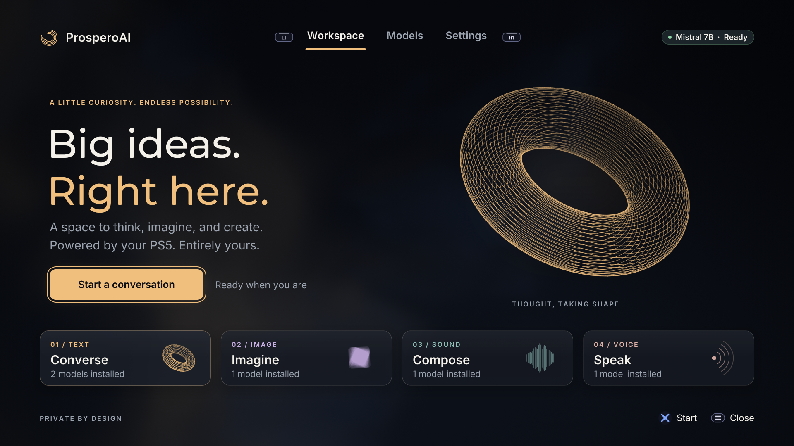
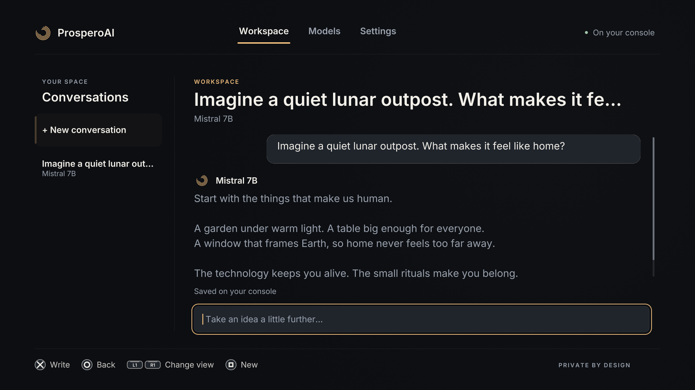
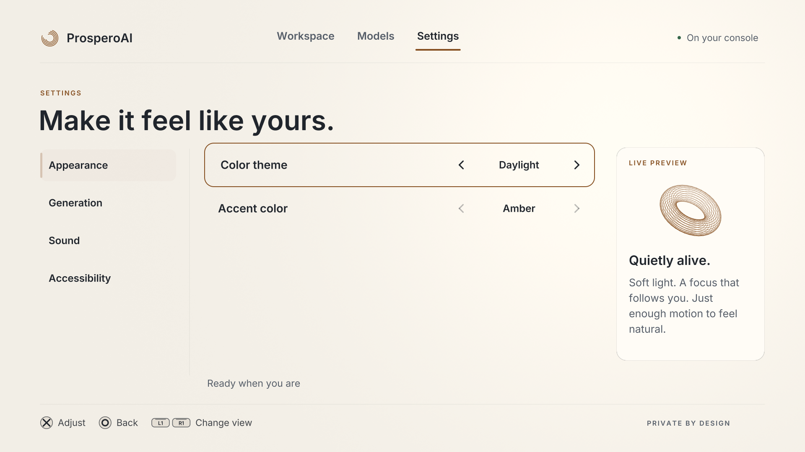

# Native UI

ProsperoAI's interface is drawn with OpenGL through
[ps5-homebrew-ui](https://github.com/blackbearreloaded/ps5-homebrew-ui), fetched at a
pinned commit when the app is built ([ui-kit/README.md](../ui-kit/README.md)). The old
RmlUi document renderer, its bitmap-font engine and FreeType are gone from the
repository. SDL remains for the media decoder, the input clock and the system-keyboard
helpers.

These pictures are the production frontend drawn on a PC with stand-in models and
storage. They are not console captures and show no real model output.






## Pages and controls

L1 and R1 change page. Options asks to close the app once nothing is running and the
conversation is saved. The row at the bottom right always names what the buttons do on
the page, and a dialog shows its own.

| Page | What it does |
| --- | --- |
| **Workspace** | Opens on a welcome page that says what is installed. Cross starts a conversation: with an empty prompt it opens the system keyboard (whose Done sends), with a typed one it sends. Square starts a new conversation. Left moves to the conversation list, where Cross opens one and Triangle deletes it after a confirmation. Triangle retries a failed answer or plays the latest saved audio. The right stick or Up and Down scroll. |
| **Models** | The model under the focus leads the page; the grid below scrolls over any number of models. Square searches (a USB keyboard types straight into the search), Triangle steps through the kinds, Cross chooses a model after a confirmation. |
| **Settings** | Appearance (Midnight or Daylight, three accents), Generation, Sound, Accessibility (reduced motion, high contrast, reading size) and About (version and credits). Circle returns to the categories. Changes apply at once and are saved in the background. |

## What the player sees and hears

- **An opening.** The console's splash stays up until the first frame; then the mark draws
  itself in while the model catalogue is read, and the page arrives underneath.
- **A backdrop that follows the app.** A slow cloud shader behind every page takes the
  accent colour and the colour of the model in focus (conversation, image, sound and voice
  each have one). Panels are tinted glass over it; dialogs blur what is behind them.
- **State that is always visible.** A chip in the header names the active model and what it
  is doing (Ready, Preparing, Creating). The model being prepared shows it on its card.
- **Answers that arrive.** A new message fades in; while the model thinks its row shows
  three dots, then the text with a caret; the line above the prompt counts the seconds.
  When a text answer is done the same line shows tokens, tokens per second and context
  size, as the first interface did; for media it shows the time taken.
- **Notices.** Things that finish out of sight (a model that became ready, an answer that
  completed while another page was open, a failure, a conversation deleted) arrive as a
  notice in the top right corner and leave by themselves.
- **Sound.** Every move, confirmation, refusal, page change, switch and dialog has a cue
  from the kit's "glass" set, placed in the stereo field by where it happened. The app adds
  a chime when it opens, one when a text answer is ready, a longer one for an image or a
  sound, and a typing tick for the USB keyboard. The Sound setting scales all of them.
- **Reduced motion** stops the backdrop, the idle movement and the entrances; the host
  check below proves a page at rest then never changes. **High contrast** closes the
  panels, removes the backdrop's clouds and strengthens lines and secondary text.

Controller rumble is not used: the app's controller layer has no rumble call yet.

## State and model scalability

`native_app.cpp` owns the application state. One worker serializes model discovery, model
selection and preparation, inference, media decoding, session persistence and settings
writes. The renderer does not touch the runtime or the filesystem. Worker results are
published with release/acquire synchronization and consumed on the rendering thread;
streamed text is coalesced and copied without blocking either side. Each finished job can
leave one notice (`App::take_notices`), which the interface turns into a sound or a toast.

Model discovery reads every directory batch into a vector; there is no eight-model limit.
The grid draws visible cards only, and search and filters work on descriptors, not on
hard-coded names or positions. Saved preferences and conversations refer to stable model
IDs. The legacy numeric preference file is read and migrated on the next save.

Text, image, audio and speech map to the existing runtime adapters. A compatible installed
model needs no frontend change; a new architecture still needs a runtime adapter. One
model job runs at a time. No unmeasured memory estimates are shown.

Conversations restore their recorded model; a missing model leaves the conversation
readable. A failed generation keeps the message for a retry, and sending something else
instead replaces that unanswered message (two user turns in a row would break some chat
templates). A failed save keeps the conversation in memory and blocks model and session
changes until a retry saves it, without generating again. A conversation holds 64
messages and the list shows the 64 most recent ones; older ones stay on disk.

## Text in any language

The four faces of the interface (Inter Regular and SemiBold, Montserrat Medium, DejaVu
Sans Mono) are baked at build time by the kit's own baker with its European alphabet, so
accented Latin, Greek and Cyrillic are drawn in the same face as the sentence around them.
Three more faces stand behind them as fallbacks (`src/font_set.cpp`) and are read from
disk only when a text first needs them:

| Face | Covers | Source |
| --- | --- | --- |
| `noto-sans-east-asian` | Chinese and Japanese: GB 2312, Big5, JIS X 0208, kana, full-width forms | Noto Sans SC, fetched and baked at build time |
| `noto-sans-korean` | Hangul and compatibility jamo | Noto Sans KR, the same way |
| `legacy-multilingual` | What the first interface's bitmap font has that the others do not: Arabic, Hebrew, Thai, Devanagari and other glyphs, drawn unshaped | `assets/fonts/legacy-multilingual` |

The first two are large (26 MB and 16 MB), which is why they are loaded on demand; the
frame that reads one is a long one (about 70 ms on a PC, not measured on a console).
There is no shaping engine: Arabic and Indic text is drawn as isolated glyphs from left to
right, exactly as before. Long text without spaces wraps between code points.

## Graphics and media integration

OpenGL starts before inference. `agc_lifecycle.cpp` makes the process-wide AGC
initialization shared between the two clients. Link-only AGC import declarations combine
the graphics SDK's exports with the inference wait-command declaration; these stubs are
not packaged. The application allocator implements `realloc` and `malloc_usable_size` for
its fallback allocations, so Mesa never passes a mapped allocation to the libc heap.
`src/runtime_shims.c` carries the libc entry points Mesa needs and the delayed splash
release. The title exits through the system service after releasing its resources.

Generated images decode off the rendering thread. TGA headers, dimensions and payloads are
checked; previews are downsampled to at most 1024 pixels on their longest side. Textures
upload for visible images, at most one per frame, and are released when the conversation
changes. Saved audio uses the existing player; interface cues use the kit's mixer.

A diagnostic log is off by default. A file named `dev/log.txt` in the install folder turns
it on; it is written to `/download0/ProsperoAI/logs/app.log`.

## Build and verification

```sh
BUILD_JOBS=6 make app
```

fetches and verifies the OpenGL SDK and the kit, bakes the fonts, builds the frontend and
the inference adapters, and assembles the app folder with the fonts and sounds it needs.
Model weights are not included.

Host checks and pictures of the production frontend:

```sh
python3 -m unittest discover -s tests -p 'test_native_controller.py' -v
python3 tools/host-ui-preview.py
PROSPERO_STRESS=1 python3 tools/host-ui-preview.py build/ui-preview/stress
PROSPERO_EMPTY=1 python3 tools/host-ui-preview.py build/ui-preview/empty
python3 tools/host-ui-preview.py build/ui-preview/reel --reel
```

The preview needs Clang, Mesa EGL/OpenGL, Python with Pillow, and FFmpeg for a reel. It
compiles the production controller and frontend against stand-in runtime and storage, and
walks every page, dialog and state. It runs no inference and touches no console.

The checks cover 500 model descriptors, discovery across several directory batches,
serialized runtime ownership, switching, session restore, missing models, persistence,
generation retry, save retry, the replaced unanswered message, notices, fallback faces
and their metrics, wrapping at spaces and between code points, bounded image decoding,
allocator resizing and concurrent AGC initialization. The preview reports no OpenGL error
on any page and that a reduced-motion page at rest is identical two seconds later.

## A scripted run on a console

A console cannot be driven or closed from a PC without killing the app, so a test run is
written down instead. When the install folder holds `dev/request.txt`, the app plays its
steps as if a controller and a keyboard were used (`src/dev_script.cpp`), writes a report
and half-size pictures to `/download0/ProsperoAI/dev`, waits so that a PC can copy them
(the title's storage is only readable while it runs), and closes itself the way Options
and Close do. A request is played once: its token is remembered. Without the file none of
this code does anything.

```sh
python3 tools/console-run.py <console address> tests/console/first-run.txt results/first-run
```

writes the request, starts the title with the launch controller of
[ps5-homebrew-dev-protocol](https://github.com/blackbearreloaded/ps5-homebrew-dev-protocol),
follows the report, brings back the pictures, the diagnostic log and the kernel log, checks
the console's error history, and removes the request. It never closes or kills anything.
The same script plays against the PC stand-ins with
`PROSPERO_SCRIPT=<request file> python3 tools/host-ui-preview.py <folder>`.

| Step | What it does |
| --- | --- |
| `token <word>` | Names the request (the runner adds it); a token already played is ignored |
| `limit <seconds>` | The whole run's time limit (300 unless set) |
| `wait <seconds>` | Lets time pass |
| `until started\|idle\|ready [seconds]` | Waits for the catalogue, for the worker to be idle, or for an idle worker with a prepared model |
| `press cross\|circle\|square\|triangle\|options\|l1\|r1\|up\|down\|left\|right` | One press |
| `type <text>` | USB-keyboard typing, a character a frame |
| `backspace [count]`, `submit`, `scroll <pixels>` | Backspace, Enter, and the right stick |
| `expect model <part of its id>\|answer\|image\|audio` | Fails the run unless that model is active and ready, or the last answer is of that kind |
| `shot <name>` | Saves the frame as `<name>.bmp` |
| `status` | Writes the state, the last answer's figures and the frame times since the last status |
| `quit [seconds]` | Writes the result, stays up that long, then closes the app |

A step that fails (a wait that runs out, a model that is not prepared, an `expect` that is
not met) ends the run at once: the report says `RESULT: FAILED` and the app closes after
the `quit` step's wait.

## Not verified on a console

Nothing in this interface has run on hardware yet: start-up, controller feel, the system
keyboard over OpenGL, graphics and inference sharing the GPU and memory, the time the
fallback faces take to load, sound by ear and sustained frame rate all still need a
console run.
